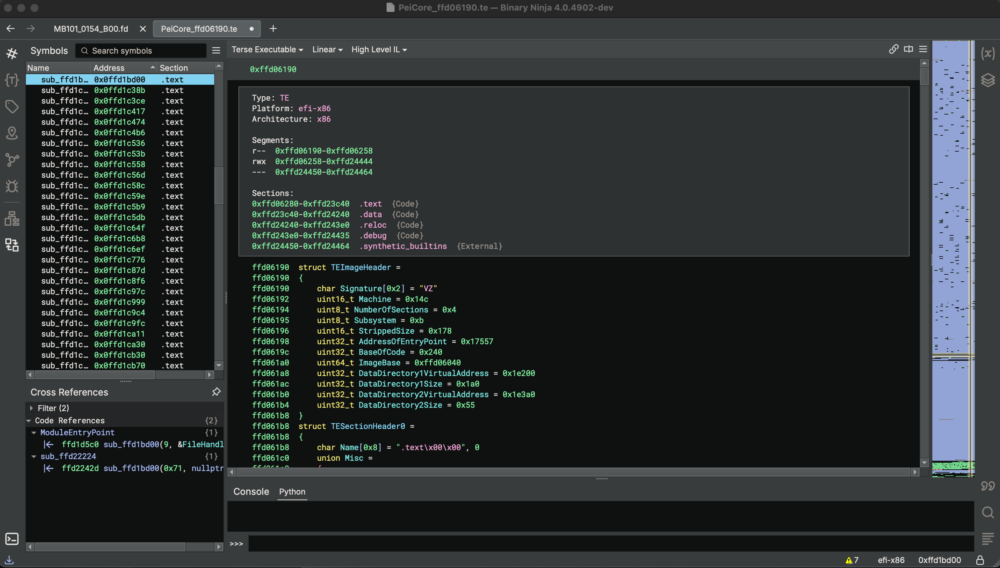

# te-loader

Author: **Brandon Miller (zznop)**

_Binary Ninja loader for EFI Terse Executables_

## Description

TE Loader is a Binary Ninja plugin for loading Terse Executables (TE). It parses the TE image
header and section headers to load the TE file into Binary Ninja and facilitate analysis. TE files
are found in UEFI firmware images. See the [efi-inspector](https://github.com/zznop/efi-inspector)
plugin to analyze and extract TE files from UEFI flash dumps.

## Installation Instructions

### Darwin

no special instructions, package manager is recommended

### Windows

no special instructions, package manager is recommended

### Linux

no special instructions, package manager is recommended

## Minimum Version

This plugin requires the following minimum version of Binary Ninja:

* 4333

## License

This plugin is released under a MIT license.

## Metadata Version

2
